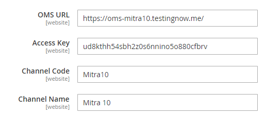
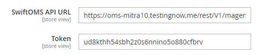

# Sales Channel
Sales channel is a website that can be handle by OMS

# Configuration
Setting configuration for connect to OMS. It located in `Configuration/SwiftOMS/Sales Chanel Configuration`

- **OMS URL** : `base url` *required*
- **Access Key** : `token` *required*
- **Channel Code** : `Channel Code` *required*
- **Channel Name** : `Channel Name`
- etc : Leave it default

!> Define channel code for unique, it used for specify channel in oms



# Xtento
Xtento is magento extention for handle order, shipment, and invoice export with xslt data. You have to add license for enable the module. 

!> You can buy xtento order export in [here][1]

[1]: https://www.xtento.com/magento-extensions/magento-order-export-module.html "Xtento Order Export"

Generate xtento license for `development`, using this code below
```
<?php

echo 'Xtento_OrderExport<br/>';
echo '{host/domain}<br/>';
echo sha1(sha1('MTWOXtento_OrderExport917370' . '_' . '{host/domain}'));
echo '';
echo '';
```
<h4>Configuration</h4>
Endpoint api for send order to OMS

- **URL Endpoint** : `https://{base_url oms}/rest/V1/magentochannel/order/`
- **Token** : `oms token`



<h4>Export Destination</h4>
Setup destination xtento for send order

- **Name** : `anything` *required*
- **Destination Type** : `Custom Class` *required*
- **Custom Class Identifier** : `\SwiftomsChannel\OrderExport\Model\Destination\Export` *required*

Module `SwiftomsChannel_OrderExport`

<h4>Export Profiles</h4>
Setup export profile xtento

- **General Configuration**
    - **Export Type** : `Order`
    - **Export each order separatly** : `Yes`
- **Export Destinations** : Select destination for order export
- **Filters/Actions**
    - **Export only new order** : `Yes`
    - **Store Views** : `All store views`
    - **Order Status** : <br>`Approved`, `Complete`, `Confirmed`, `On Hold`, `Payment Received`, `Payment Review`, `PayPal Reversed`, `Pending`, `Pending Approval 1-10`, `Pending Intenal Approval`, `Pending Ogone`, `Pending Payment`, `Pending Paypal`, `Processed Ogone Payment`, `Processing`, `Processing Ogone Payment`, `Shipped`, `Waiting Authorization`
    - **Hidden Product Type** : `Configurable Product`
- **Automatic Export** : Set cron per minutes
- **Output Format** : Sample xslt format [here](/oms/xslt/order_format.xslt ':ignore Sample Order Output Format')

```
<channel_code><xsl:text>{Channel Code}</xsl:text></channel_code>
```

<h4>Manual Export</h4>
